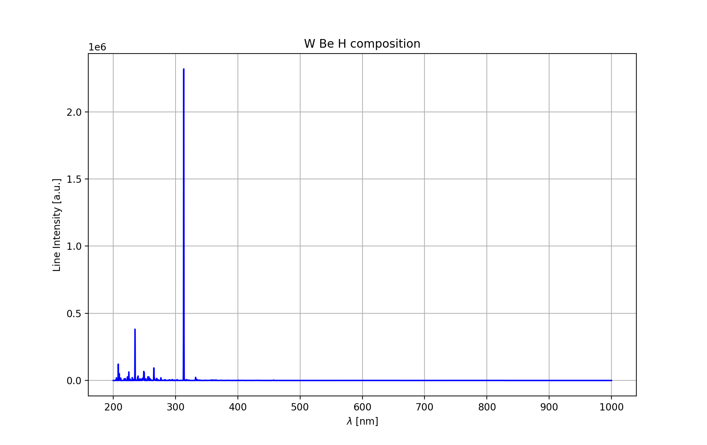

# Simulated LIBS

*SimulatedLIBS* provides simple Python class to simulate LIBS spectra with NIST LIBS Database interface.

Project created for **B.Eng. thesis**:  
Computer methods of the identification of the elements in optical spectra obtained by Laser Induced Breakdown Spectroscopy.

**Thesis supervisor**: Paweł Gąsior PhD  
e-mail: pawel.gasior@ifpilm.pl  
Institute of Plasma Physics and Laser Microfusion - IPPLM


## Installation
```python
pip install SimulatedLIBS
```
## Import 
```python
from SimulatedLIBS import simulation
```
## Example
Parameters:  
- Te - electron temperature [eV]
- Ne - electron density [cm^-3]
- elements - list of elements 
- percentages - list of elements concentrations
- resoulution
- wavelength range: low_w, upper_w
- maximal ion charge: max_ion_charge 
```python
libs = simulation.SimulatedLIBS(Te=1.0, Ne=10**17, elements=['W','H','Be'],percentages=[50,25,25],
                                resolution=1000,low_w=200,upper_w=1000,max_ion_charge=3)
```

### Plot
```python
libs.plot(color='blue', title='W Be H composition')
```


### Save to file
```python
libs.save_to_csv('filename.csv')
```

### Interpolated spectrum
SimulatedLIBS interpolates retrieved data from NIST with cubic splines
```python
libs.get_interpolated_spectrum()
```

### Raw spectrum
Raw retrieved data from NIST
```python
libs.get_raw_spectrum()
```

### Random dataset of samples
Based on .csv file with chemical composition of samples, one can generate dataset of simulated LIBS measurements  
with different Te and Ne values

Example of input .csv file:

|W  |H  |He |name|
|---|---|---|----|
|50 |25 |25 |A   |
|30 |60 |10 |B   |
|40 |40 |20 |C   |

```python
if __name__ == '__main__':
    simulation.SimulatedLIBS.create_dataset(input_csv_file="data.csv", output_csv_file='output.csv', size=100, Te_min=1.0, Te_max=2.0, Ne_min=10**17, Ne_max=10**18)
```

Output .csv file with random dataset:

|200.0 200.1 200.2 200.3 200.4 200.5  ...   W   H  He name    Te[eV] Ne[cm^-3]   |
|--------------------------------------------------------------------------------|
|   0.0   0.0   0.0   0.0   0.0   0.0  ...  50  25  25    A  1.903169  8.135195  | 
|   0.0   0.0   0.0   0.0   0.0   0.0  ...  50  25  25    B  1.875769  8.577279  | 
|   0.0   0.0   0.0   0.0   0.0   0.0  ...  50  25  25    C  1.380989  2.721672  | 
|   0.0   0.0   0.0   0.0   0.0   0.0  ...  50  25  25    B  1.603346  7.212683  | 
|   0.0   0.0   0.0   0.0   0.0   0.0  ...  30  60  10    C  1.066663   1.72329  |  
|..   ...   ...   ...   ...   ...   ...  ...  ..  ..  ..  ...       ...       ...| 
|   0.0   0.0   0.0   0.0   0.0   0.0  ...  50  25  25    C  1.033522  7.843848  | 
|   0.0   0.0   0.0   0.0   0.0   0.0  ...  30  60  10    B   1.45366  5.954206  | 
|   0.0   0.0   0.0   0.0   0.0   0.0  ...  40  40  20    C  1.637389  5.352168  | 
|   0.0   0.0   0.0   0.0   0.0   0.0  ...  40  40  20    C  1.499676  9.249321  | 
|   0.0   0.0   0.0   0.0   0.0   0.0  ...  40  40  20    C  1.902492  5.901092  |